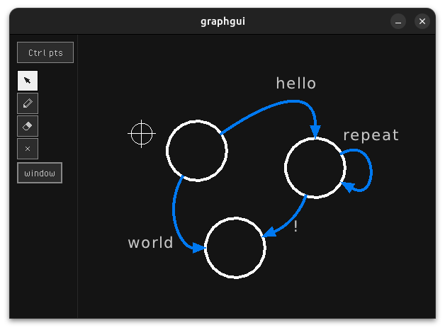

# A simple directed graph drawing tool with raylib

> [!WARNING]
> this is work in progress

This is a simple project, for learning purposes, exploring the functionality of [raylib](https://github.com/raysan5/raylib).

## quick start
copy the raylib source to `raylib` folder and run:
``` bash
pushd raylib/raylib-5.0/src
# make RAYLIB_MODULE_RAYGUI=TRUE
make RAYLIB_MODULE_RAYGUI=TRUE RAYLIB_MODULE_RAYGUI_PATH=../examples/shapes
popd
./build.sh
```

